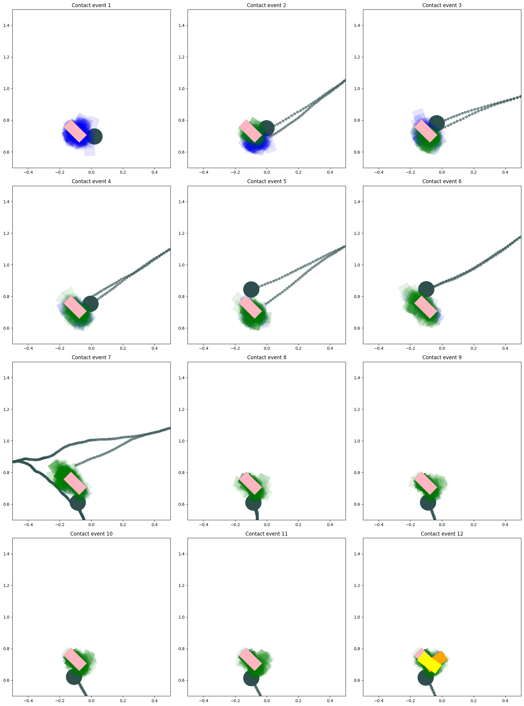

## Belief Dynamics Learning

This repository contains code for [differentiable particle filters (DPFs)](https://arxiv.org/abs/1805.11122) applied to a setting where a blind robotic manipulator is tasked with grasping objects using contact observations. We use DPFs to learn the belief dynamics and predict the state of an object's pose. We also introduce a negative proposing algorithm to account for the sparsity in contact observaions.


## Dependencies

The code is based on python3 and the following libraries.
numpy
```
conda install numpy
```
matplotlib
```
conda install matplotlib
```
PyTorch
```
conda install pytorch torchvision -c pytorch
```

## Usage

Navigate to `/scripts` directory and run the `data_generator_2d.py`. This will store data generated in the `/data` folder.

After this is done, you can prepare the dataset, train, test and visualize the DPF by going through `notebooks/dpf_notebook.ipynb`.

As next steps, you can experiment with hyperparameters in `notebooks/dpf_notebook.ipynb`, different datasets generated from `data_generator_2d.py`, and so on. The DPF implementation, training code, and testing/evauluation code can be found in `belief_dynamics_learning/dpf.py`.

